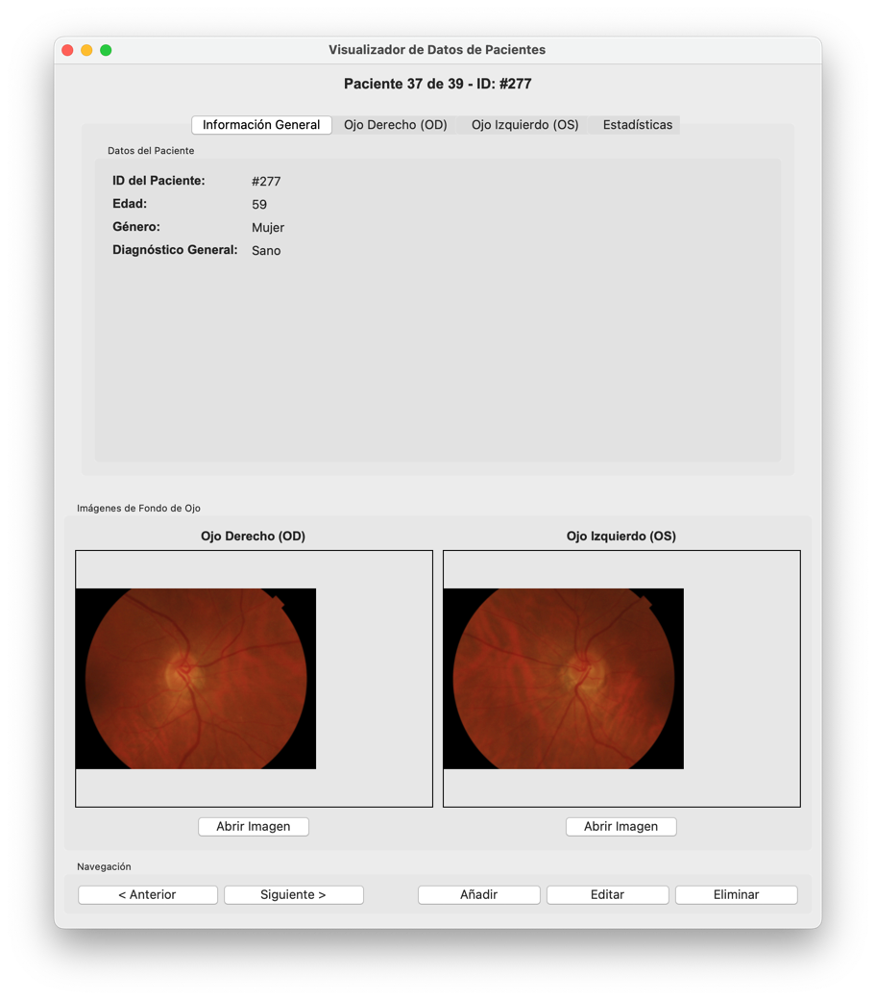

# Visualizador de Datos de Pacientes PAPILA

Esta aplicación proporciona una interfaz gráfica para la gestión y visualización de datos de pacientes del dataset PAPILA (Dataset with fundus images and clinical data of both eyes of the same patient for glaucoma assessment). La implementación utiliza Tkinter para la interfaz de usuario y sigue principios de arquitectura modular con el patrón Vertical Slice.



## Características

- **Visualización de datos de pacientes:** Información demográfica y clínica completa
- **Visualización de imágenes de fondo de ojo:** Para ambos ojos (OD y OS)
- **Gestión de pacientes:** Añadir, editar y eliminar pacientes
- **Estadísticas del conjunto de datos:** Visualización de distribuciones y métricas
- **Interfaz intuitiva:** Navegación sencilla entre pacientes y datos

## Estructura del Proyecto

El proyecto sigue una arquitectura modular por características (Vertical Slice):

```
patient_viewer/
│
├── main.py                     # Punto de entrada de la aplicación
├── .env                        # Variables de entorno para configuración
│
├── core/                       # Modelos y lógica central
│   ├── __init__.py
│   └── models.py               # Clases Patient, EyeData, etc.
│
├── features/                   # Funcionalidades agrupadas por dominio
│   ├── __init__.py
│   ├── patient_management.py   # Gestión de pacientes
│   ├── data_loading.py         # Carga de datos
│   └── image_handling.py       # Manejo de imágenes
│
├── ui/                         # Componentes de interfaz de usuario
│   ├── __init__.py
│   ├── app.py                  # Clase principal PatientViewer
│   ├── patient_form.py         # Formulario para añadir/editar pacientes
│   ├── patient_display.py      # Visualización de datos
│   └── tabs/                   # Pestañas de la interfaz
│       ├── __init__.py
│       ├── general_tab.py
│       ├── eye_tab.py
│       └── stats_tab.py
│
└── utils/                      # Utilidades comunes
    ├── __init__.py
    ├── file_operations.py      # Operaciones con archivos
    └── path_utils.py           # Utilidades para manejar rutas
```

## Requisitos

- Python 3.6 o superior
- Bibliotecas requeridas: 
  - tkinter (incluido en la mayoría de instalaciones de Python)
  - Pillow (PIL)
  - pandas
  - python-dotenv

## Instalación

1. Clona este repositorio:
```bash
git clone https://github.com/IonVillarreal/patient_viewer.git
cd patient_viewer
```

2. Crea un entorno virtual (opcional pero recomendado):
```bash
python -m venv venv
source venv/bin/activate  # En Windows: venv\Scripts\activate
```

3. Instala las dependencias:
```bash
pip install pillow pandas python-dotenv
```

4. Configura las variables de entorno:
   - Crea un archivo `.env` en el directorio raíz con el siguiente contenido:
   ```
   FUNDUS_IMAGES_DIR=FundusImages
   OD_EXCEL_FILE=patient_data_od.xlsx
   OS_EXCEL_FILE=patient_data_os.xlsx
   ```

5. Crea la estructura de directorios y archivos necesarios:
```bash
mkdir -p FundusImages
python -c "import pandas as pd; pd.DataFrame({'patient_id':[], 'age':[], 'gender':[], 'diagnosis':[], 'sphere':[], 'cylinder':[], 'axis':[], 'crystalline_status':[], 'pneumatic_iop':[], 'perkins_iop':[], 'pachymetry':[], 'axial_length':[], 'mean_defect':[], 'image_path':[]}).to_excel('patient_data_od.xlsx', index=False); pd.DataFrame({'patient_id':[], 'age':[], 'gender':[], 'diagnosis':[], 'sphere':[], 'cylinder':[], 'axis':[], 'crystalline_status':[], 'pneumatic_iop':[], 'perkins_iop':[], 'pachymetry':[], 'axial_length':[], 'mean_defect':[], 'image_path':[]}).to_excel('patient_data_os.xlsx', index=False);"
```

## Ejecución

Para iniciar la aplicación:

```bash
python main.py
```

## Uso de la Aplicación

### Navegación Básica

- La interfaz principal muestra los datos del paciente actual con pestañas para diferentes secciones.
- Use los botones "Anterior" y "Siguiente" para navegar entre pacientes.

### Gestión de Pacientes

1. **Añadir Paciente**:
   - Haga clic en "Añadir Paciente"
   - Complete el formulario con los datos requeridos
   - Haga clic en "Guardar"

2. **Editar Paciente**:
   - Seleccione el paciente que desea editar
   - Haga clic en "Editar Paciente"
   - Modifique los datos según sea necesario
   - Haga clic en "Guardar"

3. **Eliminar Paciente**:
   - Seleccione el paciente que desea eliminar
   - Haga clic en "Eliminar Paciente"
   - Confirme la eliminación

### Visualización de Imágenes

- Las imágenes de fondo de ojo se muestran en el panel derecho de la interfaz.
- Haga clic en "Abrir Imagen" para ver la imagen en tamaño completo en su visor de imágenes predeterminado.

### Estadísticas

- La pestaña "Estadísticas" muestra información resumida sobre todos los pacientes en el conjunto de datos.
- Incluye distribuciones por género, diagnóstico y estadísticas de edad.

## Estructura de Datos

### Archivos Excel

La aplicación utiliza dos archivos Excel para almacenar los datos:

1. **patient_data_od.xlsx**: Datos de ojos derechos
2. **patient_data_os.xlsx**: Datos de ojos izquierdos

Cada archivo tiene las siguientes columnas:
- `patient_id`: Identificador único del paciente
- `age`: Edad del paciente
- `gender`: Género (0 = Hombre, 1 = Mujer)
- `diagnosis`: Diagnóstico (0 = Sano, 1 = Glaucoma, 2 = Sospechoso)
- `sphere`, `cylinder`, `axis`: Datos de error refractivo
- `crystalline_status`: Estado del cristalino (0 = Fáquico, 1 = Pseudofáquico)
- `pneumatic_iop`, `perkins_iop`: Mediciones de presión intraocular
- `pachymetry`: Paquimetría
- `axial_length`: Longitud axial
- `mean_defect`: Defecto medio del campo visual
- `image_path`: Ruta a la imagen de fondo de ojo

### Imágenes

Las imágenes de fondo de ojo se almacenan en el directorio `FundusImages` con la siguiente convención de nombres:
- Ojo derecho: `RET{patient_id}OD.jpg`
- Ojo izquierdo: `RET{patient_id}OS.jpg`

## Personalización

### Cambiar rutas de archivos

Modifique el archivo `.env` para cambiar las rutas de los archivos:
```
FUNDUS_IMAGES_DIR=ruta/a/su/directorio/de/imágenes
OD_EXCEL_FILE=ruta/a/su/archivo/excel/od.xlsx
OS_EXCEL_FILE=ruta/a/su/archivo/excel/os.xlsx
```

## Contribuciones

Las contribuciones son bienvenidas. Por favor, siga estos pasos:

1. Bifurque el repositorio
2. Cree una rama para su característica (`git checkout -b feature/amazing-feature`)
3. Confirme sus cambios (`git commit -m 'Add some amazing feature'`)
4. Suba su rama (`git push origin feature/amazing-feature`)
5. Abra una Pull Request

## Notas sobre la Arquitectura

Este proyecto implementa el patrón de arquitectura "Vertical Slice", que organiza el código por funcionalidad en lugar de por capas técnicas. Cada módulo encapsula una característica completa, lo que facilita el mantenimiento y la extensión.

## Licencia

Este proyecto está licenciado bajo la Licencia MIT - vea el archivo [LICENSE](LICENSE) para más detalles.

## Contacto

Si tiene preguntas o comentarios sobre este proyecto, no dude en contactarnos en [su-email@ejemplo.com].